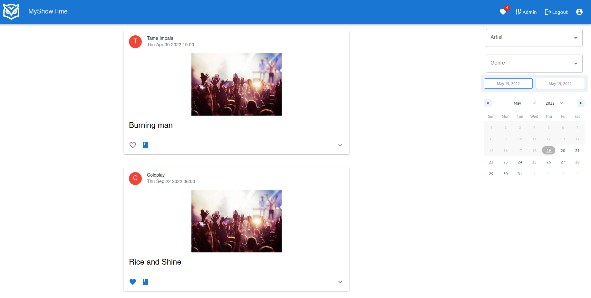

# Show_Time

Show_Time is a booking website for concert / festival tickets. 
Uses React.js as front end, Nest.js as back end and MongoDB as the database.

## Description

### HomePage

This page displays all the information of all the shows and the filters can let users filter the shows by artists and genres.
The canlendar is for searching the shows in a specific period. 
All the shows contains the artist, the date, the time and the title of the show. 
Users can also press the 'read more' button to have the description of the show.
Users can put the show in their wishlist by clicking the heart button and book the show by clicking the book button.

### Authentification 
Build an API using Nest.js with TypeScript and then persist data into your database using MongoDB. 
Authenticate a user by verifying their "credentials" (such as username/password, JSON Web Token (JWT), or identity token from an Identity Provider)
Manage authenticated state by issuing JWT.
Attach information about the authenticated user to the Request object for further use in route handlers
Protect some of the endpoints with the application by ensuring and verifying the JWT (JSON Web Token). 

### User profile
This page is protected, the user can edit all personal information and see the concerts ther user has booked. 

### Admin page
This page is restricted to users and can only be reached by admins. They can: 
- Check KPI
- See, edit and delete users’ profiles.  
- See, create, edit and delete genres.  
- See, create, edit and delete concerts.
- See, create, edit and delete bands.
- 
- 